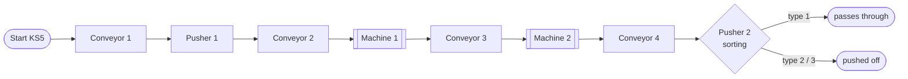
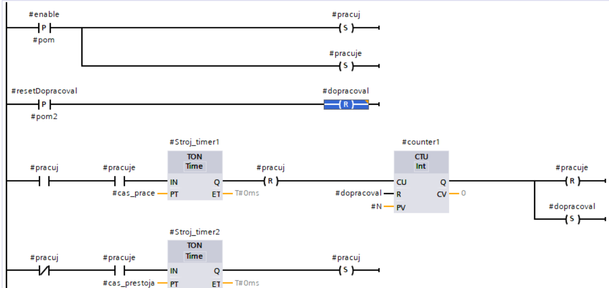

# plc-production-line-s7-1200
S7-1200 production line control in TIA Portal (LAD): conveyors, machines, pushers and part sorting.
# PLC Production Line Model – Siemens S7-1200

Control program for a production line model with **4 conveyors, 2 processing machines and 2 pushers**. Each part's type (ID) is tracked as it moves down the line, and parts are **sorted by type** at the end.

Written in **ladder logic (LAD)** in **TIA Portal V15.1**, with reusable function blocks. University assignment, PLC course, FEI STU Bratislava.

| | |
|---|---|
| **PLC** | Siemens S7-1200, CPU 1215C DC/DC/DC |
| **Software** | TIA Portal V15.1 |
| **Language** | LAD |

---

## How the line works

1. **Start** (KS5) loads a part onto conveyor 1 and gives it an ID.
2. **Pusher 1** moves it to conveyor 2 once the next conveyor is free.
3. **Machine 1** and **Machine 2** each run N work/pause cycles (N = 2). While a machine is working, its conveyor is blocked.
4. The ID is passed from block to block, so the line always knows which part is where.
5. At the end, the ID sets the conveyor 4 timing (type 1: 3 s, type 2: 0.5 s, type 3: 0.7 s). **Pusher 2** sorts types 2 and 3 off the line; type 1 passes through.

Each section starts only when the next one is free (`full` flags), so parts never collide.

## Reusable function blocks

| Block | Instances | Purpose |
|---|---|---|
| **FB1 `Dopravnik`** (conveyor) | 4× | Runs the belt, takes over the part ID from the previous section, sets a `full` flag, supports a block signal and a stop delay |
| **FB2 `Stroj`** (machine) | 2× | Work/pause cycle with two TON timers; a CTU counts cycles up to N, then signals `dopracoval` (finished) |
| **FB3 `Posuvac`** (pusher) | 2× | Moves the cylinder forward/back using end-position sensors; has a sorting mode |

## I/O

| Inputs | | Outputs | |
|---|---|---|---|
| I0.6 | KS5 – start | Q0.4 / Q0.5 / Q0.7 / Q1.1 | Conveyors D1–D4 |
| I0.0 / I0.1 | Pusher 1 front / back | Q0.1 / Q0.0 | Pusher 1 forward / back |
| I0.3 / I0.2 | Pusher 2 front / back | Q0.2 / Q0.3 | Pusher 2 forward / back |
| I0.4, I0.5, I0.7, I1.0 | Part sensors OS1–OS4 | Q0.6 / Q1.0 | Machines S1 / S2 |

## How to open

The project is a **TIA Portal archive** (`.zap15_1`), so it has to be **retrieved**, not opened:

1. Open **TIA Portal V15.1** or newer.
2. Go to **Project → Retrieve…** and select the `.zap15_1` file.
3. Choose a folder to extract it to. The project then opens.
